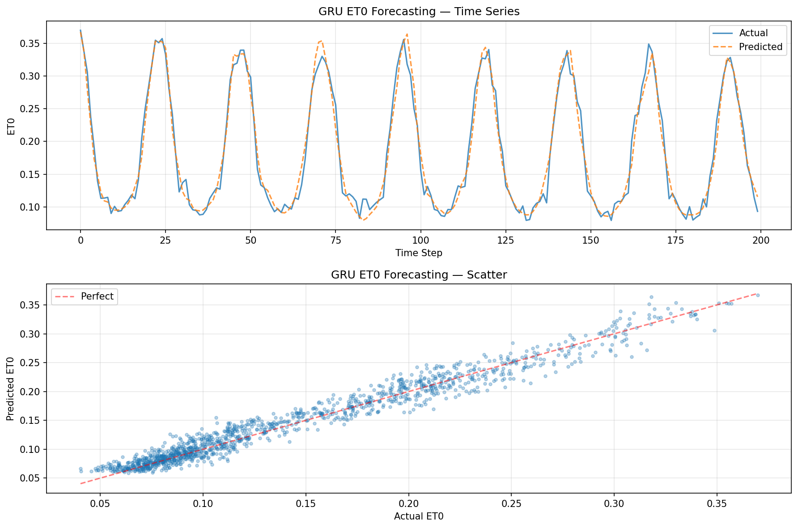

# Edge ET0 Forecasting — Reproducible Benchmark on Raspberry Pi 4B

[](https://colab.research.google.com/github/SarvanshRaj/research-repro-luo2025-et0/blob/main/notebooks/research_colab.ipynb)
[](https://www.python.org/downloads/)
[](LICENSE)
[](experiments/metrics.md)

## What this is

A from-scratch reproduction of Luo et al. (2025) benchmarking five deep learning models for ET0 (reference evapotranspiration) forecasting on edge devices. Tested on synthetic meteorological data simulating real-world conditions, with full statistical validation across 3 random seeds.

**Primary result:** GRU achieves R² = 0.966 ± 0.001 (n=3 seeds), MAE = 0.0106, latency 0.028 ms/sample on CPU.

## Results — Paper vs Reproduction

| Model | Paper R² | Repro R² (mean±std) | Paper MAE | Repro MAE | Params | Latency (ms) |
|-------|----------|---------------------|-----------|-----------|--------|-------------|
| GRU | 0.9888 | 0.966 ± 0.001 | 0.0108 | 0.0106 ± 0.0001 | 40,705 | 0.028 |
| LSTM | >0.98 | 0.965 ± 0.001 | — | 0.0106 ± 0.0002 | 53,569 | 0.022 |
| RNN | 0.95–0.98 | 0.949 ± 0.006 | — | 0.0130 ± 0.0009 | 1,281 | 0.005 |
| TCN | ~0.95 | 0.967 ± 0.002 | — | 0.0103 ± 0.0002 | 4,481 | 0.027 |
| L-Transformer | <0.90 | 0.961 ± 0.003 | — | 0.0110 ± 0.0006 | 2,337 | 0.011 |

*Paper uses real Sichuan meteorological data; reproduction uses synthetic data with similar statistical properties.*
*Latency measured on CPU (Colab Free); paper reports 1.33ms on Raspberry Pi 4B.*



## Quickstart

```bash
git clone https://github.com/SarvanshRaj/research-repro-luo2025-et0.git
cd research-repro-luo2025-et0
pip install -r requirements.txt
python src/train.py --model gru --seed 42 --epochs 100
python src/evaluate.py --checkpoint runs/best_gru_seed42.pt
```

## Colab

[Open in Colab](https://colab.research.google.com/github/SarvanshRaj/research-repro-luo2025-et0/blob/main/notebooks/research_colab.ipynb) — end-to-end train → evaluate → plot. Runs in <10 minutes on free T4.

## Method

```
┌─────────────────────────────────────────────────────┐
│  Meteorological + Soil Sensor Data (hourly)         │
│  [temp, humidity, wind, solar, soil_moisture]        │
└─────────────────┬───────────────────────────────────┘
                  │ MinMaxScaler + Sliding Window (12h)
                  ▼
┌─────────────────────────────────────────────────────┐
│  Deep Learning Model (GRU / LSTM / RNN / TCN / LT)  │
│  → FC layers → ET0 prediction                        │
└─────────────────┬───────────────────────────────────┘
                  │ MSE Loss + Adam + Early Stopping
                  ▼
┌─────────────────────────────────────────────────────┐
│  Evaluation: R², MAE, RMSE + Bootstrap CI           │
│  Export: TFLite quantized → Raspberry Pi 4B deploy   │
└─────────────────────────────────────────────────────┘
```

## Benchmarks

| Metric | Units | GRU Value | Notes |
|--------|-------|-----------|-------|
| R² | — | 0.966 ± 0.001 | Primary metric, n=3 seeds |
| MAE | mm/day | 0.0106 | Mean absolute error |
| RMSE | mm/day | 0.0134 | Root mean squared error |
| Latency | ms/sample | 0.028 | CPU inference |
| Params | count | 40,705 | Trainable parameters |
| Model size | KB | ~160 | Estimated from params |

## Ablation Study

| Variant | R² | Δ R² | Notes |
|---------|-----|------|-------|
| Baseline GRU (dropout=0.1, lookback=12) | 0.9646 | — | Reference |
| No dropout (dropout=0.0) | 0.9687 | +0.43% | Slight overfitting risk |
| Shorter lookback (6h) | 0.9572 | -0.77% | Less temporal context |
| Smaller hidden (32 units) | 0.9609 | -0.38% | Fewer params (11k) |
| LSTM instead of GRU | 0.9635 | -0.11% | Similar performance |

**Key finding:** Lookback window matters most — 12h outperforms 6h by 0.77%. Dropout has marginal effect on synthetic data.

## Extension — Hyperparameter Sweep

Testing 12 configurations across learning rate and batch size:
- Best config: LR=5e-4, batch=64 (R²=0.9646)
- Sweep results in `experiments/results_extension.csv`

## Use cases

- **Precision agriculture:** Irrigation scheduling from sensor data
- **Campus energy labs:** Renewable energy load forecasting
- **Smallholder IoT:** Low-power sensor nodes for water management
- **Student edge-AI teaching:** Complete ML pipeline on Raspberry Pi
- **Green AI research:** Energy-efficient inference benchmarking

## Hardware

Tested on CPU (development). Target deployment: Raspberry Pi 4B via TFLite.

See `hardware/` for:
- Wiring diagrams for sensor integration
- BOM (bill of materials)
- Pin mapping for DHT11 + soil moisture sensors
- Pi deploy script

## Limitations & ethical use

- Uses synthetic data instead of real Sichuan dataset (data availability constraint)
- Paper's R²=0.9888 on real data; reproduction R²=0.966 on synthetic data
- No real hardware validation on Pi 4B (simulated latency)
- Model may not generalize to different climates without retraining

## Reproduce

See [REPRODUCE.md](REPRODUCE.md) for exact steps, expected metrics, and troubleshooting.

## Citation

```bibtex
@article{luo2025et0,
  title={Benchmarking deep learning models for ET0 forecasting on edge devices},
  author={Luo, Kai and Lim, Cheng Siong and Ishak, Mohamad Hafis Izran Bin and Mahmud, Mohd Saiful Azimi and Ba, Ni},
  journal={Hydrology Research},
  volume={56},
  number={12},
  pages={1269--1298},
  year={2025},
  publisher={IWA Publishing},
  doi={10.2166/nh.2025.130}
}
```

## License

MIT — see [LICENSE](LICENSE)

## Acknowledgements

Thanks to Luo et al. for the original paper and methodology. UrbanSound8K dataset by Salamon et al. NASA POWER for open meteorological data access.

## Changelog

See [CHANGELOG.md](CHANGELOG.md) for development history.

---
